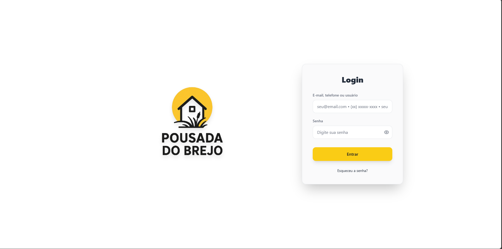
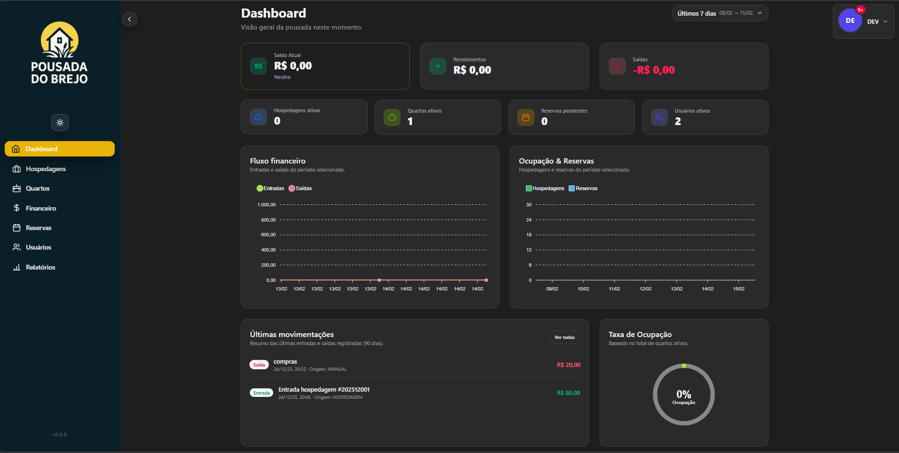
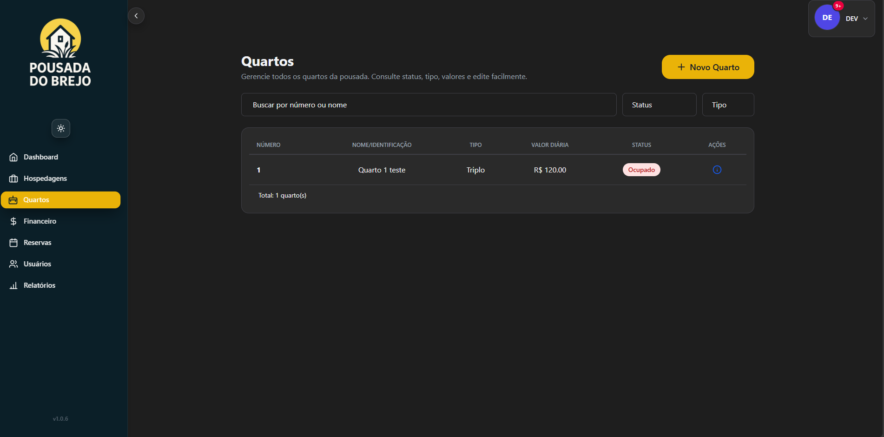
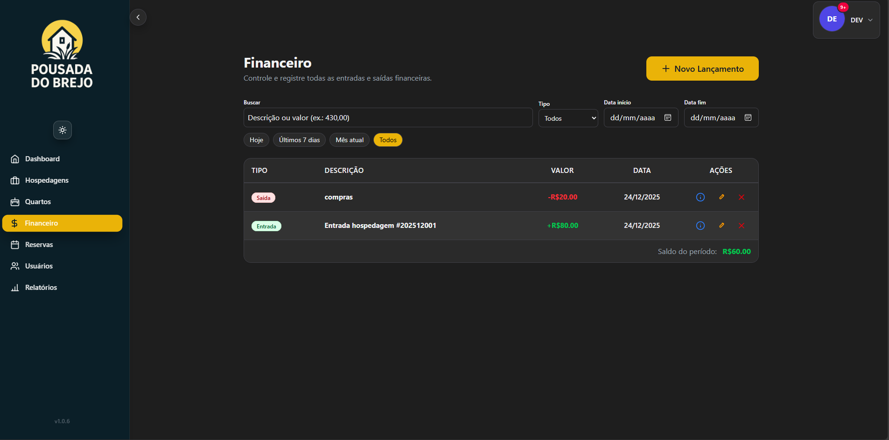
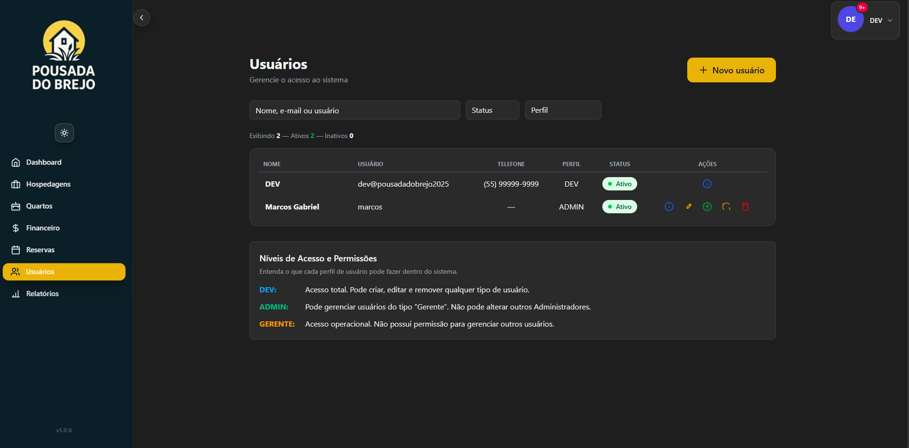
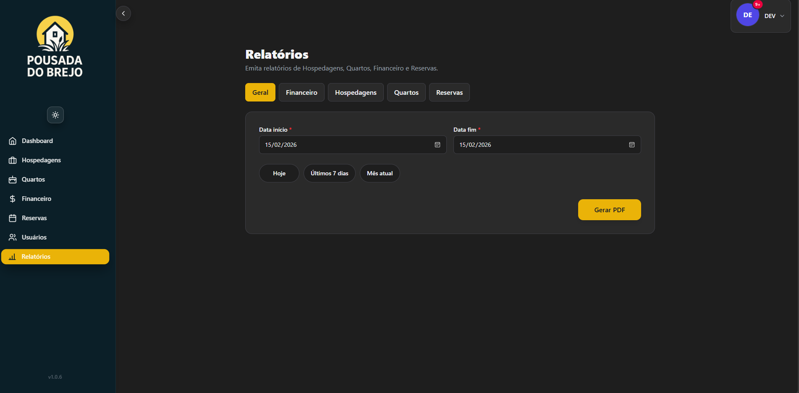

# 🏨 Sistema de Gestão para Pousada (Pousada do Brejo)

<div align="center">


**Sistema completo de gestão interna para pousadas, cobrindo o fluxo operacional, administrativo e financeiro.**

[📺 Ver Demonstração](https://youtu.be/cxnlDaoNQe8) • [🐛 Reportar Bug](https://github.com/Marcos-Gabriell/sistema-pousada/issues) • [✨ Solicitar Feature](https://github.com/Marcos-Gabriell/sistema-pousada/issues)

</div>

---

## 📋 Índice

- [Sobre o Projeto](#-sobre-o-projeto)
- [Principais Destaques](#-principais-destaques)
- [Tecnologias Utilizadas](#-tecnologias-utilizadas)
- [Módulos e Funcionalidades](#-módulos-e-funcionalidades)
- [Arquitetura do Sistema](#-arquitetura-do-sistema)
- [Como Rodar o Projeto](#️-como-rodar-o-projeto)
- [Estrutura de Pastas](#-estrutura-de-pastas)
- [Níveis de Acesso](#-níveis-de-acesso)
- [Capturas de Tela](#-capturas-de-tela)
- [Roadmap](#️-roadmap)
- [Licença e Uso](#️-licença-e-uso)
- [Contato](#-contato)

---

## 📖 Sobre o Projeto

O **Sistema de Gestão para Pousada** é uma aplicação full-stack desenvolvida para otimizar e automatizar a gestão completa de pousadas, desde o cadastro de quartos até o controle financeiro detalhado.

> 🏨 **Sistema em Produção**: Este projeto está atualmente em uso na **Pousada do Brejo**, gerenciando operações reais do estabelecimento.

### Arquitetura
O projeto utiliza uma **arquitetura REST API moderna**, onde:
- **Back-end (Spring Boot)** fornece uma API RESTful completa
- **Front-end (Angular 19)** consome a API e gerencia a interface do usuário
- **Comunicação** via requisições HTTP/JSON e WebSocket para tempo real
- **Banco de dados PostgreSQL** executando em container Docker

Com foco em **segurança**, **auditoria** e **usabilidade**, o sistema oferece:
- Controle rigoroso de acesso por perfis hierárquicos (DEV, ADMIN, GERENTE)
- Validações anti-conflito para reservas e hospedagens
- Rastreabilidade completa de ações sensíveis
- Interface moderna e responsiva com Dark/Light Mode
- Notificações em tempo real via WebSocket
- Geração de relatórios e comprovantes em PDF

---

## ✨ Principais Destaques

### 🏗️ Arquitetura Moderna
- ✅ **API RESTful** com separação clara Front-end/Back-end
- ✅ Comunicação via HTTP/JSON
- ✅ WebSocket para real-time
- ✅ Organização modular por domínio
- ✅ Arquitetura em camadas (API → Service → Repository)

### 🔐 Segurança Robusta
- ✅ Autenticação e autorização com **Spring Security + JWT**
- ✅ Validação de token em todas as requisições
- ✅ Hierarquia de perfis com permissões granulares
- ✅ Obrigatoriedade de troca de senha no primeiro acesso
- ✅ Auditoria completa de ações críticas

### 👥 Gestão Inteligente de Usuários
- ✅ **3 níveis de acesso**: DEV, ADMIN e GERENTE
- ✅ Criação interna de usuários com geração automática de senha
- ✅ Perfil editável (nome, email, foto)
- ✅ Sistema de notificações personalizadas
- ✅ Foto de perfil armazenada no banco de dados

### 🏠 Controle Total de Quartos
- ✅ CRUD completo com validações anti-duplicidade
- ✅ Status dinâmicos: Disponível, Ocupado, Manutenção
- ✅ Filtros avançados por status
- ✅ Bloqueio automático contra conflitos de ocupação

### 📅 Reservas e Hospedagens Inteligentes
- ✅ Sistema de reservas com confirmação automática
- ✅ Conversão de reserva confirmada em hospedagem
- ✅ Validação de disponibilidade em tempo real
- ✅ **Regra de negócio**: Um quarto não pode ter duas reservas/hospedagens no mesmo período
- ✅ Notificações automáticas de criação, edição e exclusão

### 💰 Módulo Financeiro Integrado
- ✅ Entrada automática ao criar hospedagem
- ✅ Controle detalhado de entradas e saídas
- ✅ Código financeiro único por transação
- ✅ Auditoria de alterações com rastreio completo
- ✅ Geração de comprovantes financeiros em PDF

### 📊 Dashboard Inteligente
- ✅ Visão geral com indicadores-chave (KPIs)
- ✅ Gráficos de entradas vs saídas
- ✅ Gráficos de ocupação por período
- ✅ Taxa de ocupação em tempo real
- ✅ Filtros customizáveis por data
- ✅ Métricas: Saldo geral, hospedagens ativas, quartos ocupados/disponíveis, reservas pendentes

### 📄 Relatórios e Comprovantes Profissionais
**Comprovantes (Gerados no Front-end com jsPDF)**
- ✅ Comprovante de Reserva
- ✅ Comprovante de Hospedagem
- ✅ Comprovante de Entrada/Saída Financeira

**Relatórios (Gerados no Back-end com Thymeleaf)**
- ✅ Relatório Geral (visão consolidada)
- ✅ Relatório Financeiro
- ✅ Relatório de Hospedagens
- ✅ Relatório de Reservas
- ✅ Relatório de Quartos

### 🔔 Notificações em Tempo Real (WebSocket)
- ✅ Criação de novos usuários
- ✅ Criação, edição e exclusão de hospedagens
- ✅ Confirmação de reservas
- ✅ Alteração de senhas
- ✅ Painel centralizado de notificações

### 🎨 Interface Moderna
- ✅ Design responsivo para desktop, tablet e mobile
- ✅ **Dark Mode** e **Light Mode**
- ✅ Sidebar expansível e retrátil
- ✅ Experiência de usuário intuitiva

---

## 🧱 Tecnologias Utilizadas

### Back-end
| Tecnologia | Versão | Descrição |
|------------|--------|-----------|
|  | 11 | Linguagem principal |
|  | 2.7+ | Framework principal |
|  | - | Segurança e autenticação |
|  | - | Persistência de dados |
|  | 14+ | Banco de dados relacional |
|  | - | Notificações em tempo real |
|  | - | Geração de relatórios PDF |
|  | 20+ | Containerização |

### Front-end
| Tecnologia | Versão | Descrição |
|------------|--------|-----------|
|  | 19 | Framework SPA |
|  | 5+ | Linguagem tipada |
|  | 7+ | Programação reativa |
|  | 4 | Framework CSS |
|  | - | Geração de PDFs |

### DevOps
- Docker Compose para orquestração
- Git para versionamento

---

## 🧩 Módulos e Funcionalidades

### 1️⃣ Módulo de Autenticação e Segurança
```
🔐 Autenticação JWT
├── Login com email e senha
├── Geração e validação de tokens
├── Refresh token automático
└── Logout seguro

🛡️ Autorização Hierárquica
├── DEV: Controle total do sistema
├── ADMIN: Controle total exceto gerenciar outros ADMINs
└── GERENTE: Acesso apenas ao fluxo operacional

🔑 Gestão de Senhas
├── Geração automática no cadastro
├── Obrigatoriedade de troca no primeiro login
└── Alteração de senha pelo próprio usuário
```

### 2️⃣ Módulo de Usuários
```
👤 Cadastro e Gestão
├── Criação interna de usuários (por ADMIN/DEV)
├── Geração automática de senha inicial
├── Edição de perfil (nome, email)
├── Upload e armazenamento de foto no banco
└── Gerenciamento de notificações

📊 Auditoria
├── Rastreio de criação de usuários
├── Log de alterações de senha
└── Histórico de ações por usuário
```

### 3️⃣ Módulo de Quartos
```
🏠 Gestão Completa
├── CRUD (Create, Read, Update, Delete)
├── Validação anti-duplicidade de número/nome
├── Status: Disponível, Ocupado, Manutenção
├── Filtros por status
└── Bloqueio automático em conflitos de reserva

🔍 Consultas Avançadas
├── Listagem paginada
├── Busca por número/nome
└── Verificação de disponibilidade por período
```

### 4️⃣ Módulo de Reservas
```
📅 Gestão de Reservas
├── Criação com validação de disponibilidade
├── Edição de reservas pendentes
├── Exclusão com validação de status
├── Confirmação automática → Gera Hospedagem
└── Notificações em tempo real

⚠️ Validações de Negócio
├── Bloquear reservas em datas conflitantes
├── Impedir múltiplas reservas no mesmo período
├── Validar data de entrada < data de saída
└── Verificar status do quarto
```

### 5️⃣ Módulo de Hospedagens
```
🛏️ Gestão de Hospedagens
├── Criação manual ou via confirmação de reserva
├── Entrada automática no financeiro
├── Edição com auditoria
├── Check-out e finalização
└── Notificações automáticas

💼 Integração Financeira
├── Geração automática de entrada ao criar hospedagem
├── Código financeiro único
├── Rastreio de valores
└── Comprovante em PDF
```

### 6️⃣ Módulo Financeiro
```
💰 Controle Financeiro
├── Entradas automáticas (hospedagens)
├── Saídas manuais (despesas)
├── Código único por transação
├── Saldo consolidado em tempo real
└── Auditoria de alterações

📈 Relatórios
├── Relatório de entradas
├── Relatório de saídas
├── Relatório de saldo por período
├── Comprovantes individuais
└── Exportação em PDF
```

### 7️⃣ Dashboard Inteligente
```
📊 Indicadores (KPIs)
├── Saldo geral atual
├── Hospedagens ativas
├── Quartos ocupados vs disponíveis
├── Reservas pendentes
└── Usuários ativos

📉 Gráficos Dinâmicos
├── Entradas vs Saídas (linha temporal)
├── Ocupação por período (barras)
├── Taxa de ocupação (percentual)
└── Filtros customizáveis por data
```

### 8️⃣ Sistema de Notificações
```
🔔 Notificações em Tempo Real (WebSocket)
├── Criação de usuários
├── Criação/edição/exclusão de hospedagens
├── Confirmação de reservas
├── Alteração de senhas
└── Painel centralizado de notificações

📱 Gerenciamento
├── Marcar como lida
├── Excluir notificação
└── Filtros por tipo
```

---

## 🏗️ Arquitetura do Sistema

### Arquitetura REST API

O sistema utiliza uma **arquitetura REST API moderna** com separação clara entre Front-end e Back-end:


### Comunicação REST API
- **Front-end** consome a API REST do Back-end via requisições HTTP
- **WebSocket** para notificações em tempo real
- **JWT** para autenticação stateless
- **JSON** como formato de troca de dados

---


## 📁 Estrutura de Pastas

### Back-end (Spring Boot)
```
api-pousada/
├── src/
│   ├── main/
│   │   ├── java/br/com/pousada/pousada/
│   │   │   │
│   │   │   ├── 🔐 auth/                    # Módulo de Autenticação
│   │   │   │   ├── api/                    # AuthController
│   │   │   │   ├── application/            # AuthService
│   │   │   │   ├── domain/                 # Entidades de Auth
│   │   │   │   ├── dtos/                   # LoginDTO, TokenDTO
│   │   │   │   └── infra/                  # Repositórios
│   │   │   │
│   │   │   ├── ⚙️ config/                   # Configurações Globais
│   │   │   │   ├── SecurityConfig.java
│   │   │   │   ├── WebSocketConfig.java
│   │   │   │   └── CorsConfig.java
│   │   │   │
│   │   │   ├── 📊 dashboard/               # Módulo Dashboard
│   │   │   │   ├── api/                    # DashboardController
│   │   │   │   ├── application/            # DashboardService
│   │   │   │   └── dtos/                   # DashboardDTO
│   │   │   │
│   │   │   ├── ⚠️ exception/                # Tratamento de Exceções
│   │   │   │   ├── GlobalExceptionHandler.java
│   │   │   │   ├── ResourceNotFoundException.java
│   │   │   │   └── BusinessException.java
│   │   │   │
│   │   │   ├── 💰 financeiro/              # Módulo Financeiro
│   │   │   │   ├── api/                    # FinanceiroController
│   │   │   │   ├── application/            # FinanceiroService
│   │   │   │   ├── domain/                 # Entidade Financeiro
│   │   │   │   ├── dtos/                   # FinanceiroDTO
│   │   │   │   └── infra/                  # FinanceiroRepository
│   │   │   │
│   │   │   ├── 🛏️ hospedagens/              # Módulo Hospedagens
│   │   │   │   ├── api/                    # HospedagemController
│   │   │   │   ├── application/            # HospedagemService
│   │   │   │   ├── domain/                 # Entidade Hospedagem
│   │   │   │   ├── dtos/                   # HospedagemDTO
│   │   │   │   └── infra/                  # HospedagemRepository
│   │   │   │
│   │   │   ├── 🔔 notificacoes/            # Módulo Notificações
│   │   │   │   ├── api/                    # NotificacaoController
│   │   │   │   ├── application/            # NotificacaoService
│   │   │   │   ├── domain/                 # Entidade Notificacao
│   │   │   │   ├── dtos/                   # NotificacaoDTO
│   │   │   │   └── infra/                  # NotificacaoRepository
│   │   │   │
│   │   │   ├── 🏠 quartos/                 # Módulo Quartos
│   │   │   │   ├── api/                    # QuartoController
│   │   │   │   ├── application/            # QuartoService
│   │   │   │   ├── domain/                 # Entidade Quarto
│   │   │   │   ├── dtos/                   # QuartoDTO
│   │   │   │   └── infra/                  # QuartoRepository
│   │   │   │
│   │   │   ├── 📄 reporting/               # Módulo Relatórios (PDF)
│   │   │   │   ├── api/                    # ReportController
│   │   │   │   ├── application/            # ReportService
│   │   │   │   └── templates/              # Templates Thymeleaf
│   │   │   │
│   │   │   ├── 📅 reservas/                # Módulo Reservas
│   │   │   │   ├── api/                    # ReservaController
│   │   │   │   ├── application/            # ReservaService
│   │   │   │   ├── domain/                 # Entidade Reserva
│   │   │   │   ├── dtos/                   # ReservaDTO
│   │   │   │   └── infra/                  # ReservaRepository
│   │   │   │
│   │   │   ├── 🛡️ security/                 # Módulo de Segurança
│   │   │   │   ├── AuthPrincipal.java
│   │   │   │   ├── JwtFilter.java
│   │   │   │   ├── JwtTokenService.java
│   │   │   │   ├── JwtUtil.java
│   │   │   │   ├── SecurityConfig.java
│   │   │   │   ├── SecurityUtils.java
│   │   │   │   └── WebSocketAuthInterceptor.java
│   │   │   │
│   │   │   ├── 👥 usuarios/                # Módulo Usuários
│   │   │   │   ├── api/                    # UsuarioController
│   │   │   │   ├── application/            # UsuarioService
│   │   │   │   ├── domain/                 # Entidade Usuario
│   │   │   │   ├── dtos/                   # UsuarioDTO
│   │   │   │   ├── infra/                  # UsuarioRepository
│   │   │   │   └── jobs/                   # Tarefas agendadas
│   │   │   │
│   │   │   └── 🔧 util/                    # Utilitários
│   │   │       └── PousadaApplication.java
│   │   │
│   │   └── resources/
│   │       ├── application.properties       # Configurações
│   │       ├── application-dev.properties
│   │       ├── application-prod.properties
│   │       └── templates/                   # Templates PDF
│   │
│   └── test/                                # Testes
│
├── pom.xml                                  # Dependências Maven
├── Dockerfile
└── docker-compose.yml
```

### Front-end (Angular 19)
```
pousada-frontend/
├── src/
│   ├── app/
│   │   │
│   │   ├── 📱 components/                   # Componentes Reutilizáveis
│   │   │   ├── account/                    # Componente de Conta
│   │   │   ├── navbar/                     # Barra de Navegação
│   │   │   ├── notifications/              # Painel de Notificações
│   │   │   ├── perfil/                     # Perfil do Usuário
│   │   │   └── senha-negado/               # Forçar Troca de Senha
│   │   │
│   │   ├── 🔧 core/                         # Núcleo da Aplicação
│   │   │   ├── guards/                     # Guards de Rota
│   │   │   │   ├── auth.guard.ts           # Proteção de autenticação
│   │   │   │   └── role.guard.ts           # Proteção por role
│   │   │   │
│   │   │   ├── interceptors/               # Interceptors HTTP
│   │   │   │   ├── token.interceptor.ts    # Injeção de JWT
│   │   │   │   └── error.interceptor.ts    # Tratamento de erros
│   │   │   │
│   │   │   └── services/                   # Serviços Globais
│   │   │       ├── api.service.ts
│   │   │       ├── auth.service.ts
│   │   │       ├── websocket.service.ts
│   │   │       └── notification.service.ts
│   │   │
│   │   ├── 📄 pages/                        # Páginas (Feature Modules)
│   │   │   ├── acesso-negado/              # Página de Acesso Negado
│   │   │   ├── dashboard/                  # Dashboard Principal
│   │   │   ├── financeiro/                 # Gestão Financeira
│   │   │   ├── hospedagens/                # Gestão de Hospedagens
│   │   │   ├── login/                      # Página de Login
│   │   │   ├── pagina-nao-encontrada/      # 404 Not Found
│   │   │   ├── quartos/                    # Gestão de Quartos
│   │   │   ├── relatorios/                 # Relatórios e Comprovantes
│   │   │   ├── reservas/                   # Gestão de Reservas
│   │   │   ├── user-menu/                  # Menu do Usuário
│   │   │   └── users/                      # Gestão de Usuários
│   │   │
│   │   ├── 🔗 shared/                       # Módulos Compartilhados
│   │   │   ├── models/                     # Interfaces TypeScript
│   │   │   ├── pipes/                      # Pipes customizados
│   │   │   └── directives/                 # Diretivas customizadas
│   │   │
│   │   ├── app.component.ts                # Componente Raiz
│   │   ├── app.component.html
│   │   ├── app.component.css
│   │   ├── app.config.ts                   # Configurações
│   │   └── app.routes.ts                   # Rotas
│   │
│   ├── assets/                              # Recursos Estáticos
│   │   ├── images/
│   │   └── icons/
│   │
│   ├── environments/                        # Ambientes
│   │   ├── environment.ts                  # Desenvolvimento
│   │   └── environment.prod.ts             # Produção
│   │
│   ├── index.html
│   ├── main.ts                              # Entry Point
│   └── styles.css                           # Estilos Globais
│
├── package.json
├── tailwind.config.js                       # Configuração Tailwind
├── angular.json                             # Configuração Angular
├── tsconfig.json                            # Configuração TypeScript
└── Dockerfile
```

### Organização por Camadas (Padrão de cada módulo Back-end)

Cada módulo do back-end segue a **arquitetura em camadas**:

```
modulo/
├── api/          → Controllers REST (Endpoints HTTP)
├── application/  → Services (Lógica de Negócio)
├── domain/       → Entities (Modelo de Domínio JPA)
├── dtos/         → Data Transfer Objects (Comunicação API)
└── infra/        → Repositories (Acesso ao Banco de Dados)
```

**Fluxo de Requisição**:
```
Cliente → Controller (api/) → Service (application/) → Repository (infra/) → Database
```

---

## 👥 Níveis de Acesso

| Perfil | Descrição | Permissões |
|--------|-----------|------------|
| **DEV** | Desenvolvedor | ✅ Controle total do sistema<br>✅ Gerenciar todos os usuários (incluindo ADMINs)<br>✅ Acesso a todas as funcionalidades<br>✅ Configurações avançadas |
| **ADMIN** | Administrador | ✅ Controle total do sistema<br>✅ Gerenciar GERENTEs<br>❌ Não pode criar/editar outros ADMINs<br>✅ Acesso a relatórios e dashboards<br>✅ Gestão financeira |
| **GERENTE** | Gerente Operacional | ✅ Gestão de quartos<br>✅ Gestão de reservas<br>✅ Gestão de hospedagens<br>✅ Visualização de dashboards<br>❌ Sem acesso ao financeiro<br>❌ Sem acesso à gestão de usuários |

### Fluxo de Primeiro Acesso
1. ADMIN/DEV cria usuário internamente
2. Sistema gera senha automática e envia ao usuário
3. No primeiro login, o sistema **obriga** a troca de senha
4. Após trocar a senha, o usuário tem acesso completo ao sistema

---

## 📸 Capturas de Tela

### 🔐 Login


### 📊 Dashboard


### 🛏️ Gestão de Hospedagens


### 🏠 Gestão de Quartos


### 💰 Módulo Financeiro


### 📅 Gestão de Reservas


### 👥 Gestão de Usuários


### 📄 Relatórios


---

## 🗺️ Roadmap

### ✅ Concluído
- [x] Autenticação e autorização com JWT
- [x] Gestão completa de usuários (DEV, ADMIN, GERENTE)
- [x] Gestão de quartos com validações anti-conflito
- [x] Sistema de reservas e hospedagens
- [x] Módulo financeiro integrado
- [x] Dashboard com KPIs e gráficos dinâmicos
- [x] Relatórios em PDF (back-end com Thymeleaf)
- [x] Comprovantes em PDF (front-end com jsPDF)
- [x] Notificações em tempo real via WebSocket
- [x] Dark Mode / Light Mode
- [x] Interface responsiva
- [x] Arquitetura REST API moderna
- [x] Containerização com Docker

### 🚀 Próximas Melhorias
- [ ] **Melhorias de Performance e UX**
  - [ ] Otimização de queries no banco de dados
  - [ ] Lazy loading de módulos no front-end
  - [ ] Cache de dados frequentes
  - [ ] Melhoria na responsividade mobile

- [ ] **Sistema de Reservas Online para Clientes**
  - [ ] Portal público para clientes fazerem reservas
  - [ ] Consulta de disponibilidade em tempo real
  - [ ] Pagamento online integrado
  - [ ] Confirmação automática por email

- [ ] **Automação de Processos**
  - [ ] Recuperação automática de senha (email)
  - [ ] Envio de emails de confirmação de reserva
  - [ ] Notificações por email para hospedagens
  - [ ] Lembretes automáticos de check-in/check-out

- [ ] **Evolução de Relatórios e Dashboards**
  - [ ] Mais gráficos e métricas avançadas
  - [ ] Exportação de relatórios em Excel
  - [ ] Análise preditiva de ocupação
  - [ ] Comparativo de períodos

- [ ] **Rastreabilidade e Auditoria Avançada**
  - [ ] Log detalhado de todas as ações
  - [ ] Histórico completo de alterações
  - [ ] Relatórios de auditoria por usuário
  - [ ] Dashboard de atividades suspeitas

### 💡 Ideias Futuras
- [ ] Integração com gateways de pagamento (Stripe, PayPal, Mercado Pago)
- [ ] Integração com canais de venda (Booking.com, Airbnb)
- [ ] Sistema de avaliações de hóspedes
- [ ] Gestão de estoque e manutenção
- [ ] Sistema de fidelidade e cupons de desconto
- [ ] Chatbot para atendimento automático
- [ ] Análise de dados com Machine Learning

---

## ⚖️ Licença e Uso

**⚠️ AVISO IMPORTANTE**

Este é um **sistema proprietário** desenvolvido especificamente para uso interno da **Pousada do Brejo**. 

- ❌ **Não é permitida** a cópia, redistribuição ou uso comercial deste código
- ❌ **Não é permitido** criar trabalhos derivados sem autorização expressa
- ℹ️ O código está disponível publicamente apenas para **fins de portfólio e demonstração**
- 📧 Para consultas sobre licenciamento ou uso, entre em contato com o autor

**Todos os direitos reservados © 2024 Marcos Gabriel**

---

## 👤 Autor

<div align="center">

**Marcos Gabriel**

[](https://github.com/Marcos-Gabriell)
[](https://www.linkedin.com/in/seu-perfil)
[](mailto:seu-email@exemplo.com)

</div>

---

## 🎥 Demonstração

Veja o sistema em funcionamento:

[](https://youtu.be/cxnlDaoNQe8)

**Link direto**: [https://youtu.be/cxnlDaoNQe8](https://youtu.be/cxnlDaoNQe8)

---

<div align="center">

**⭐ Se este projeto foi útil para você, considere dar uma estrela no repositório!**

Made with ❤️ by [Marcos Gabriel](https://github.com/Marcos-Gabriell)

</div>